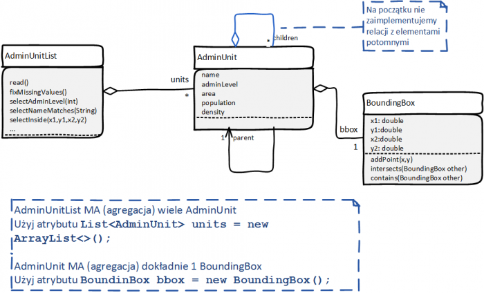

# Laboratorium 7 - województwa, powiaty, gminy, miejscowości

Plik [`admin-units.csv`](examples/admin-units.csv) zawiera informacje o jednostkach administracyjnych w Polsce wyodrębnione z mapy [Open Street Map (OSM)](https://www.openstreetmap.org/#map=6/52.018/19.137). Dane są zapisane w formacie CSV, czyli wartości poszczególnych pól oddzielone są przecinkami. Każdemu rekordowi odpowiada jeden wiersz pliku.

Naszym celem będzie wczytanie zawartości pliku do pamięci (listy) i implementacja różnych funkcji do selekcji elementów.

## Opis pól

Plik csv można otworzyć w OpenOffice. Poniżej opisy pól

- id - numer rekordu w bazie danych (long), nie chcemy tego przechowywać
- parent - numer rekordu jednostki nadrzędnej (np. województwo dla powiatu). Zamiast numeru chcemy użyć referencji. Województwa nie mają jednostki nadrzędnej (pusty tekst)
- name - nazwa jednostki (string)
- admin_level - określa typ jednostki (int). Specyfikacja jest tu (na końcu tabelki)
- population - liczba mieszkańców (double), czasem może być pusta
- area - powierzchnia (double), zawsze podana
- density - gęstość zaludnienia (double), czasem pusta
- x1,y1,x2,y2,x3,y3,x4,y4,x11,y11 - 10 współrzędnych double. Długość i szerokość geograficzna pięciu punktów wyznaczających prostokąt, w którym zawarta jest jednostka BoundingBox. Pięciu - ostatnie dwie współrzędne są powtórzeniem pierwszej, ponieważ są to współrzędne linii łamanej. Tych danych jest za dużo, wystarczyłyby 4 współrzędne i tylu użyjemy.

## Struktura klas

Struktura klas podana jest na rysunku



Zadeklaruj wymagane klasy `AdminUnitList`, `AdminUnit` i `BoundingBox`

## Czytanie z pliku

Sprawdź, czy potrafisz przeczytać zawartość pliku za pomocą napisanej poprzednio klasy CSVReader:

- wczytaj rekord (wiersz)
- pobierz zawartość wybranych pól i wydrukuj
- przerwij odczyt po 100 rekordach, bo nie ma sensu drukować na ekranie wszystkiego

## Klasa BoundingBox v.1

Na razie zadeklaruj niezbyt funkcjonalną klasę `BoundingBox`. W pierwszej wersji nie będzie przetwarzana

public class BoundingBox {
    double xmin;
    double ymin;
    double xmax;
    double ymax;
}

## Klasa AdminUnit

Zadeklaruj klasę `AdminUnit`.

```java
public class AdminUnit {
    String name;
    int adminLevel;
    double population;
    double area;
    double density;
    AdminUnit parent;
    BoundingBox bbox = new BoundingBox();
}
```

Zauważ, że w odróżnieniu od zawartości pliku:

- nie ma tu id
- parent nie jest liczbą long ale referencją.
- Podczas czytania jakoś to będzie trzeba przekonwertować.

### toString()

Dodaj metodę `toString()` wypisującą podstawowe informacje (nazwa, typ jednostki, powierzchnia, itp.)

## Klasa AdminUnitList

Klasa przechowuje listę obiektów typu `AdminUnit`.

### Zadeklaruj klasę

```java
public class AdminUnitList {
    List<AdminUnit> units = new ArrayList<>();
}
```

### Odczyt z pliku v.1

Dodaj metodę `public void read(String filename)`.

```java
/**
 * Czyta rekordy pliku i dodaje do listy
 * @param filename nazwa pliku
 */
public void read(String filename) {...}
```

Wewnątrz

- użyj klasy CSVReader
- czytaj kolejne rekordy (wiersze pliku)
- po przeczytaniu utwórz obiekt AdminUnit i wypełnij jego atrybuty wartościami (na razie pomijając parent)
- dodaj do listy

### Warto coś wypisać

Napisz trzy metody klasy `AdmiUnitList`

```java
/**
 * Wypisuje zawartość korzystając z AdminUnit.toString()
 * @param out
 */
void list(PrintStream out) {...}

/**
 * Wypisuje co najwyżej limit elementów począwszy od elementu o indeksie offset
 * @param out - strumień wyjsciowy
 * @param offset - od którego elementu rozpocząć wypisywanie
 * @param limit - ile (maksymalnie) elementów wypisać
 */
void list(PrintStream out, int offset, int limit) {...}
 
/**
 * Zwraca nową listę zawierającą te obiekty AdminUnit, których nazwa pasuje do wzorca
 * @param pattern - wzorzec dla nazwy
 * @param regex - jeśli regex=true, użyj finkcji String matches(); jeśli false użyj funkcji contains()
 * @return podzbiór elementów, których nazwy spełniają kryterium wyboru
 */
AdminUnitList selectByName(String pattern, boolean regex) {
    AdminUnitList ret = new AdminUnitList();
    // przeiteruj po zawartości units
    // jeżeli nazwa jednostki pasuje do wzorca dodaj do ret
    return ret;
}
```

Raczej podczas testowania używaj `void list(PrintStream out, int offset, int limit)`.

Regex (wyrażenie regularne) specyfikuje zaawansowane kryteria wyszukiwania [http://www.vogella.com/tutorials/JavaRegularExpressions/article.html](http://www.vogella.com/tutorials/JavaRegularExpressions/article.html). Funkcja `contains()` sprawdza zawieranie się łańcuchów.

W poniższych przykładach zawsze rezultatem będzie true

```java
System.out.println("województwo małopolskie".matches(".*małop.*"));
System.out.println("województwo małopolskie".matches("^wojew.*"));
System.out.println("województwo pomorskie".matches(".*skie"));
System.out.println("województwo małopolskie".contains("małop"));
```

**TODO** Wypisz wybrane jednostki wywołując `selectByName()` oraz `list()`.

Projekt interfejsu w stylu lista zwraca listę obiektów spełniających kryteria będziemy dalej rozwijać. To jest całkiem wydajne. Lista jest tablicą referencji (8-bajtowych wartości). Obiekty nie są kopiowane, więc listy nie zużywają dużo pamięci w porównaniu do obecnie dostępnych zasobów.

### Odczyt z pliku v.2

Przetwórzmy prawidłowo informacje o `parent` jednostce nadrzędnej. W pliku są zapisywane wartości `long`, które chcemy zamienić na referencje. A więc potrzebne jest odwzorowanie (*mapa*) przypisująca `Long id` → `AdminUnit`. Potrzebne jest zapewne także odwzorowanie `AdminUnit` → `Long parentid`.

- Zbieraj te informacje podczas czytania rekordów
- Po zakończeniu czytania ustaw odpowiednie referencje

Niektóre rekordy (województwa) nie mają jednostki nadrzędnej. Przypisz im `parent=null`

### Brakujące wartości

Plik wejściowy powstał z przetwarzania danych mapy. Granice jednostek były zawsze określone, stąd znana jest powierzchnia oraz można wyznaczyć `BoundingBox`. Niestety, liczba ludności nie zawsze jest podana.

Może być jednak podana w jednostce nadrzędnej (`parent`) lub jej jednostce nadrzędnej.

Napisz prywatną funkcję `AdminUnitList` o nazwie `fixMissingValues()` która:

- dla każdego obiektu `AdminUnit`, z brakującymi danymi `population` oraz `density`
-  przyjmie estymację `density = parent.density`
- obliczy `population = area * density`

Możesz dodać funkcję `fixMissingValues()` do klasy `AdminUnits`. Alternatywnie, możesz napisać funkcję `fixMissingValues(AdminUnit au)` w `AdminUnitList`.

:heavy_exclamation_mark: W jednostce `parent` też może brakować wartości. Chyba funkcja `AdminUnit.fixMissingValues()` (lub `fixMissingValues(AdminUnit au)`) powninna być rekurencyjna?

## Jednostki potomne - odczyt z pliku v.3

Dodaj w klasie `AdminUnit` zaznaczoną na diagramie relację `children`. Jest to lista jednostek składowych (np. województwo składa się z powiatów, powiat z gmin.)

Czyli deklaracja klasy powinna wyglądać następujaco:

```java
public class AdminUnit {
    String name;
    int adminLevel;
    double population;
    double area;
    double density;
    AdminUnit parent;
    BoundingBox bbox = new BoundingBox();
    List<AdminUnit> children;
    // ... metody ...
}
```

Znowu konieczne będzie odwzorowanie (*mapa*) uzupełniana podczas odczytu lub budowana na podstawie wcześniej zdefiniowanych odwzorowań.

Prawdopodobnie będzie potrzebne coś w rodzaju:

```java
Map<Long,List<Long>> parentid2childid = new HashMap<>();
```

lub

```java
Map<Long,List<AdminUnit>> parentid2child = new HashMap<>();
```

Druga wersja ma pewną zaletę - można od razu przypisać wartość do `children` w `AdminUnit`.